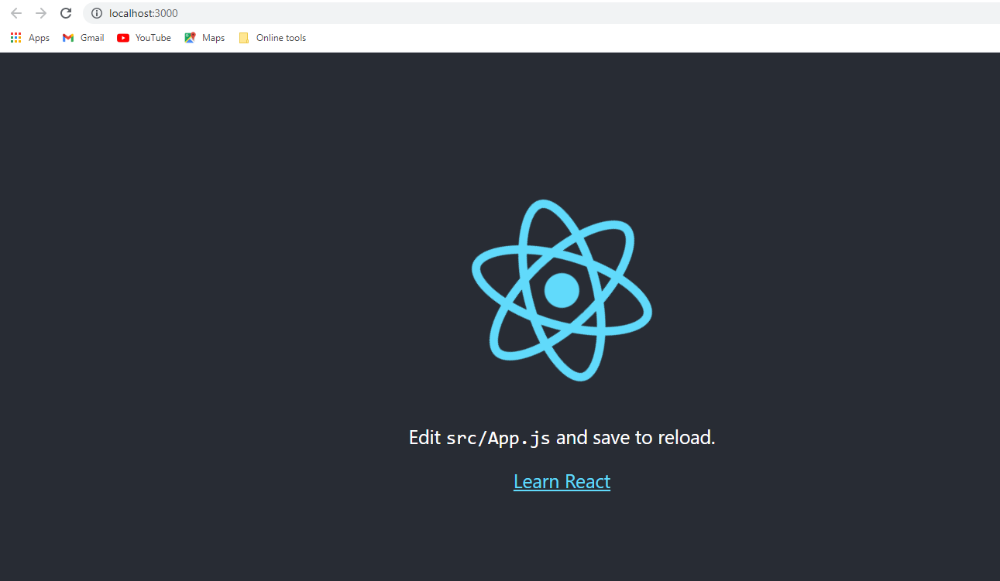

## Math Magicians ##

> This is the first project of the Math Magicians application. You will set up the environment and tools needed to develop a React application.



Additional description about the project and its features.

## Live Demo

[Live Demo Link](https://demo-app2347.herokuapp.com/)


## Built With

- HTML, CSS, JS
- Linterns, Gitflow
- React, Webpack


## Getting Started

### Prerequisites
You will need an up to date browser to render this website. Also npm to run terminal commands.

### Setup and Install
Get a local copy up and running using git clone https://github.com/herokudev/Math-Magicians.git, next we install dependencies with 'npm install'


### Usage
To test the app locally, download source code, install dependencies and excute 'npm start' command.


### Testing
​
To run all test type on the terminal:
```
npm run test
```
​
This will automatically run all the test files inside the project
​
## Authors
​
👨‍💻 **Herbert Orellana**
​
- GitHub: [@herokudev](https://github.com/herokudev)
- LinkedIn: [LinkedIn](https://www.linkedin.com/in/herbert-armando-orellana-a0b50b34/)
​
👨‍💻 **Jose Alberto Arriaga Ramos**
​
- GitHub: [@jaarkira](https://github.com/jaarkira )
- Twitter: [@91_jaar](https://twitter.com/91_jaar )
- LinkedIn: [Jose Arriaga](https://www.linkedin.com/in/jaar/)
​

## 🤝 Contributing
Contributions, issues, and feature requests are welcome!

Show your support
Give a ⭐️ if you like this project!


## 📝 License 
This project is MIT licensed.
