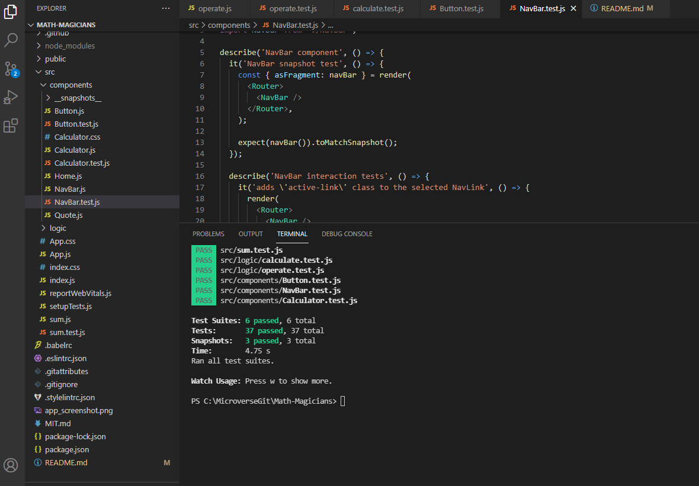

## Math Magicians ##

> This is the first project of the Math Magicians application. You will set up the environment and tools needed to develop a React application.

Additional description about the project and its features.

## Built With

- HTML, CSS, JS
- Linterns, Gitflow
- React, Webpack

## Getting Started

### Prerequisites
You will need an up to date browser to render this website. Also npm to run terminal commands.

### Setup and Install
To get a local copy up and running follow these simple example steps. You can either download the zip file, or clone the repository from [here](https://github.com/herokudev/Math-Magicians/tree/set-up) 

### Usage
To test the app locally, download source code, install dependencies and excute 'npm start' command.

## Authors (Github: Herokudev)
Herbert Orellana

- GitHub: [@herokudev](https://github.com/herokudev)
- LinkedIn: [LinkedIn](https://linkedin.com/in/armando-orellana-a0b50b34)

## 🤝 Contributing
Contributions, issues, and feature requests are welcome!

Show your support
Give a ⭐️ if you like this project!

## 📝 License 
This project is MIT licensed.